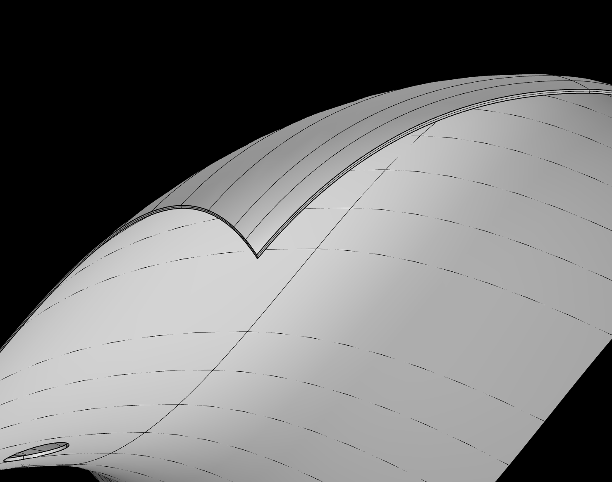

# Engineering Assessment : CAD

Hello!

Seems like you're taking the time to go through Machina Labs' quick assessment of CAD familiarity and workflow. First of all, thank you for doing this! Using computational design tools is critial to working at Machina and we know that everyone has different workflows, methods, and preferred platforms. This assignment is intended to give you a little bit of space to do things how you like to do them with something that mimics a typical part.

## The problem

You are given a CAD model of a part that we are tasked with fabricating by double sided incremental forming (DSIF). As an Applications or Process Development Engineer, part of your job is assessing the rough feasibility of the customer part, and you'll do so by evaluating the geometry against our constraints as well as modeling a rough version of a forming surface. This part is a swooping flange with some bolt/rivet holes. 

## The Constraints
From a modeling perspective, the DSIF robotic forming process is sensitive to wall angle and continuity. A forming surface must be a single continuous surface with no holes or non-manifold edges, and the wall angles must stay under ~65 degrees from horizontal. We want to mock up what that surface will look like so we can estimate things like fabrication time and how easy it will be to form accurately.

Customer parts come in all shapes and sizes and they come from an entirely different workflow so we have provided a hypothetical flange with 3 distinct issues we need you to solve.

1.	Orientation:	The flange is oriented the way it was in its master assembly. We need to orient for forming so that the wall angles are roughly* minimized.
2.	Holes:			This was meant to be bolted onto another part, but we will cut the holes out later. We have to patch the surface in CAD before forming.
3.	Thickness:		This part is modeled as a solid sheet, but to model a forming surface, we need to extract just the interior surface to work with.

*This probelm does have an optimum solution, but we're not asking for that here. As long as you keep the wall angles low, it'll be great for evaluating formability.

## The Deliverables

You have a CAD model of a geometry (a “part”) that you want to form from a sheet of metal using our robotic incremental forming process. The perimeter of the part does not lie in a plane, yet the part is to be formed from a rectangular sheet that’s initially flat and whose edges are clamped in a frame. Therefore, we want to orient the part and add surface geometry to connect it to a planar surface (this extra geometry is called a “skirt”). After forming, the part will be cut out from the formed sheet.

Your tasks are as follows:

1.	Extract the interior surface of the part
2.	Make sure it is continuous (no holes)
3.	Evaluate the wall angles and orient the part so it can be reasonably connected to the sheet plane
4. 	Model a simple skirt and provide the surface area
	
The outer perimeter edge of the skirted part should lie entirely in the Z = 0 plane (i.e., the flat sheet from which the part will be formed is located in the Z = 0 plane). The wall angle everywhere on the skirted part should be 65 degrees or less. Wall angle is defined with respect to the flat sheet.

What we want back from you:
	
1. your 'skirted' part file
2. a visualization or some sort of report on the wall angles of your part (It can be a screenshot like the one below, or you can tell us the maximum draft angle and we'll verify)
3. a surface area of the part and skirt surfaces (don't count the flat part of the sheet)

## The Scope

Feel free to use any CAD software you like. You can pick one you're really comfortable with or one you're excited about, who knows! If you have thoughts on why you chose one or another *I* for one would love to chat with you about it.

If you don't have access to a software platform at the moment, you can make a free account with OnShape, and if you're a student, there are free educational licences for Autodesk products like Fusion 360.
	https://www.onshape.com/en/products/free
	\
	https://www.autodesk.com/education/edu-software/overview?sorting=featured&filters=individual

TIMING: this should take 1, maybe 2 hours to complete, so please don't spend much more than that. We don't want you to beat your head against a wall trying to figure it out so if it's taking a long time or you feel stuck, let us know why! I would be happy to work through where things are feeling difficult as it will be just as helpful in understanding your familiarity with different software tools, or if I just screwed up in making the homework somehow.

### **Notes and Tips**

The customer file is given out as a .STP or 'step' which is a standard surface/solid file type for engineering-focused modeling software like Solidworks, Fusion, Catia, Revit, Inventor, etc. There are lots of ways to model though, so if you prefer a different format, talk to me about it! I'm happy to provide something else and discuss why STP is commonly used and why you might to work in an other format.

On downloading, feel free to browse this repo for the file and some other images. If you haven't used github/git before, you can just download the file on its own. [Here's a quick guide to that as well.](https://stackoverflow.com/questions/4604663/download-single-files-from-github)

There are lots of tools in the toolbox and you may or may not have needed all of them before. No worries! The bread and butter of surface modeling is in tools like *patch surfaces*, *loft surfaces*, *network surfaces*, *boundary surfaces*, *sweep surfaces*, or *ruled surfaces*. If you're more used to extruding solids and boolean operations for example, then maybe look up what these surfaces do and how to use them.

On evaluating draft or wall angles: most software packages have some sort of draft analysis tool, and they all work a bit differently. The most important difference is reference frame. Usually "wall angle" is defined as from the horizontal plane and "draft angle" is from the vertical plane/normal vector (wall angle = 90deg - draft angle). Some can show a continuous gradient, others use a threshold value, probably there are other things I'm not even aware of. Just find a way to communicate how you were sure the *wall angles* were not too high (>65 degrees from horizontal).

For inspiration, here is a very simple answer I quickly came up with to visualize what we're looking for, as well as an example of draft analysis from a different mock part. Don't copy me because while it looks like something that meets the requirements, it actually isn't quite good enough (shhhhh). There are a few more visuals in the asset folder as well.

Email me for whatever: daniel@machinalabs.ai

GOOD LUCK!

